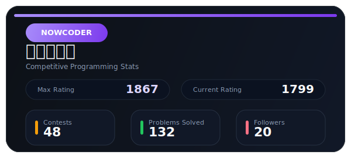

# XQHPrime

[;天天开心>)](https://git.io/typing-svg)

Code for products, think with algorithms, build with AI.

  

  &nbsp;
  &nbsp;
  

<picture>
  <source media="(prefers-color-scheme: dark)" srcset="https://raw.githubusercontent.com/XQHPrime/XQHPrime/output/github-contribution-grid-snake-dark.svg" />
  <source media="(prefers-color-scheme: light)" srcset="https://raw.githubusercontent.com/XQHPrime/XQHPrime/output/github-contribution-grid-snake.svg" />
  
</picture>

## About Me

- 嗨，我是 Qinghua Xu (XQHPrime)，一名前端工程师 + AI 应用工程师。
- 专注于现代 Web 开发、交互体验设计与 AI 能力落地，喜欢把想法快速做成真正可用、好用的产品。
- 具备扎实的程序设计基础与较强的算法思维，面对复杂问题能够快速建模、拆解并实现高质量方案。

## Contests & Algorithms

- 2025/10 - **🥈 Silver Medal** - The 2025 ICPC Asia Xi'an Regional Contest
- 2025/09 - **🏆 Champion** - The 2025 CCPC Nanchang National Invitational Contest
- 2025/05 - **🥇 Gold Medal** - The 2025 ICPC China Shaanxi National Invitational Programming Contest
- 2024/11 - **🥉 Bronze Medal** - The 2024 ICPC Asia Hangzhou Regional Contest
- 2024/10 - **🥉 Bronze Medal** - The 2024 ICPC Asia Chengdu Regional Contest
- 2024/05 - **🥉 Bronze Medal** - The 2024 CCPC Fuzhou National Invitational Contest

## Coding Profiles

  
   
  

## Tech Stack

  
  
  
  
  
  
  
  
  

  
  
  
  
  
  
  
  
  
  
  
  
  
  
  
  
  
  
  
  
  
  
  
  
  
  
  
  
  
  
  

